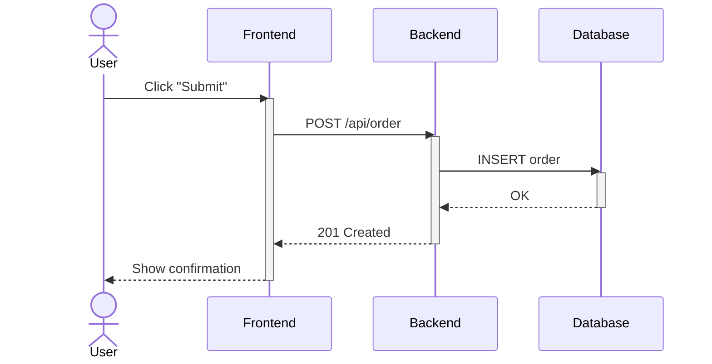
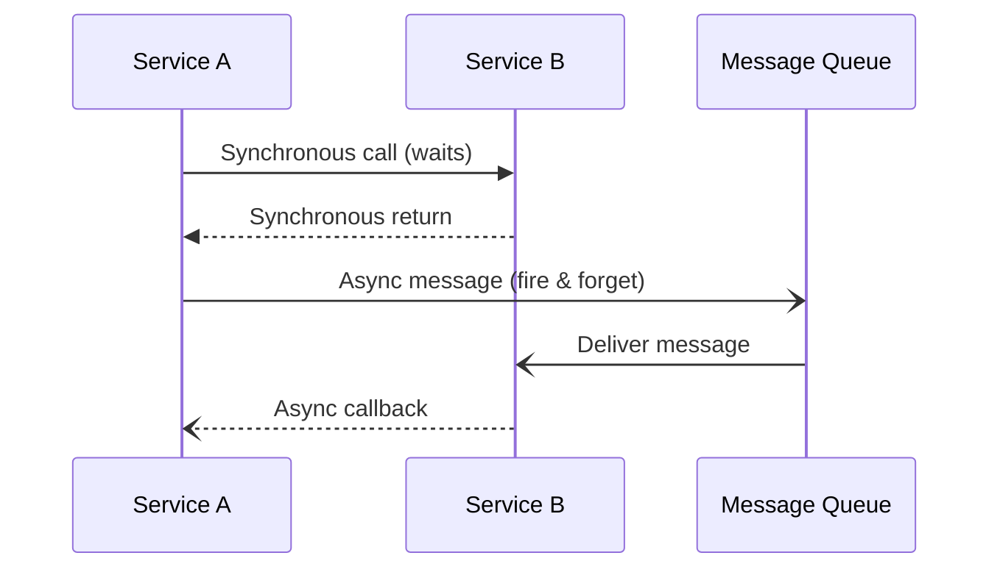
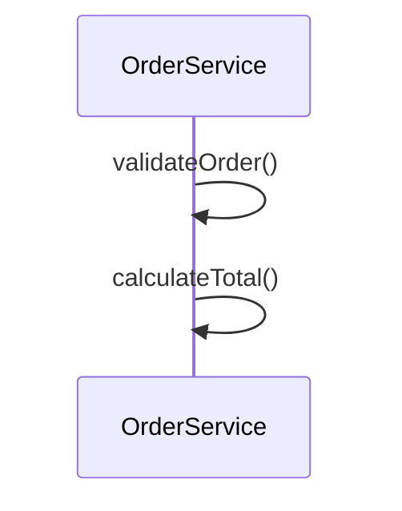
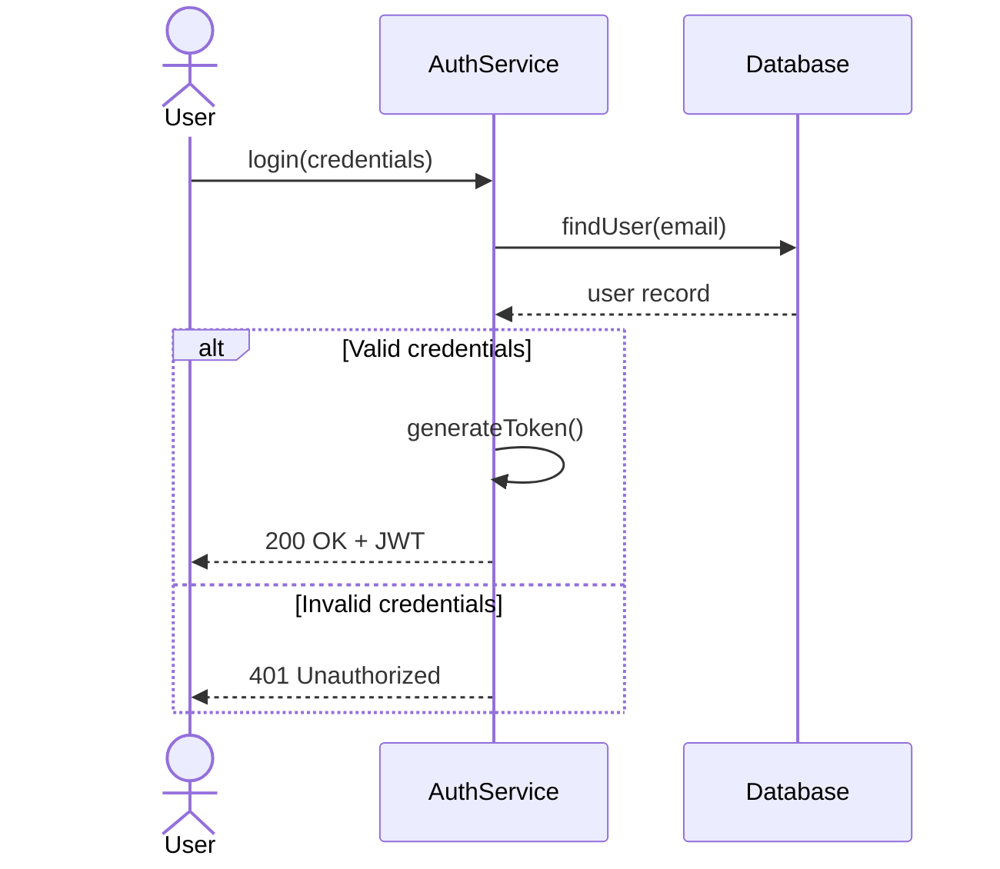
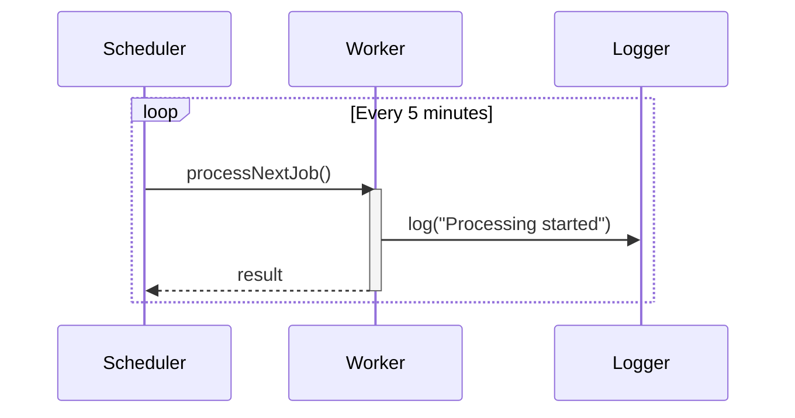
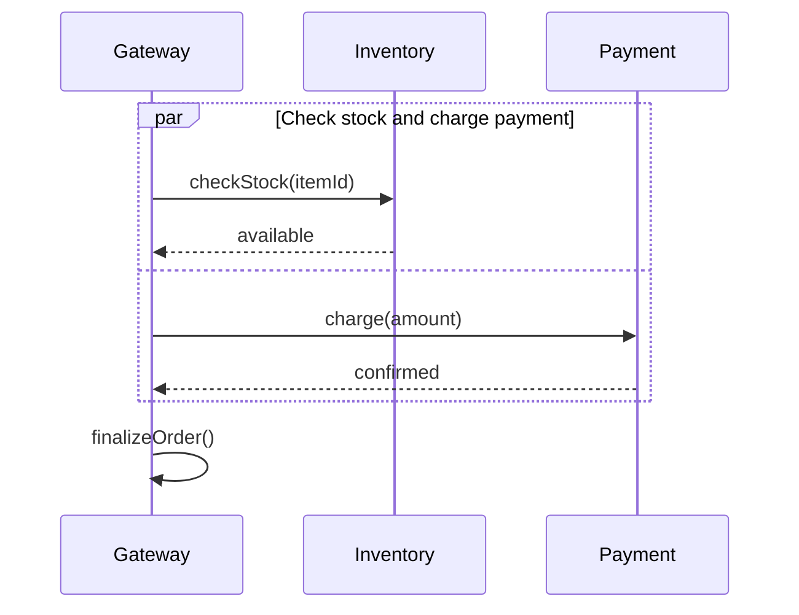
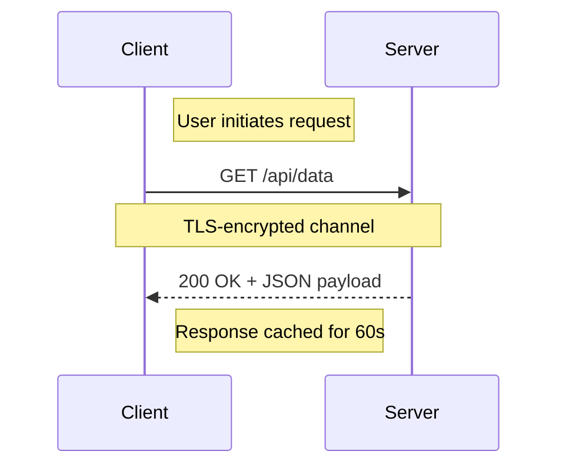
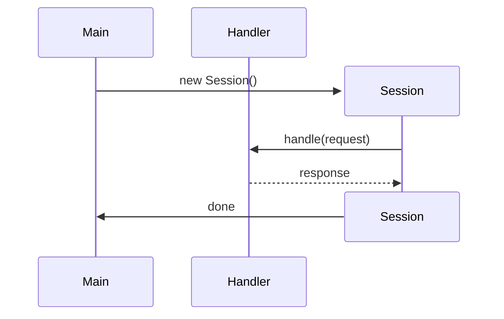
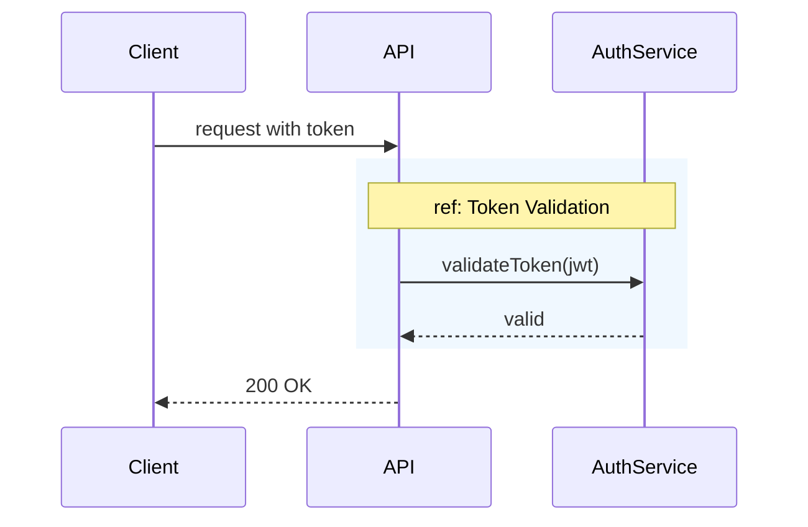
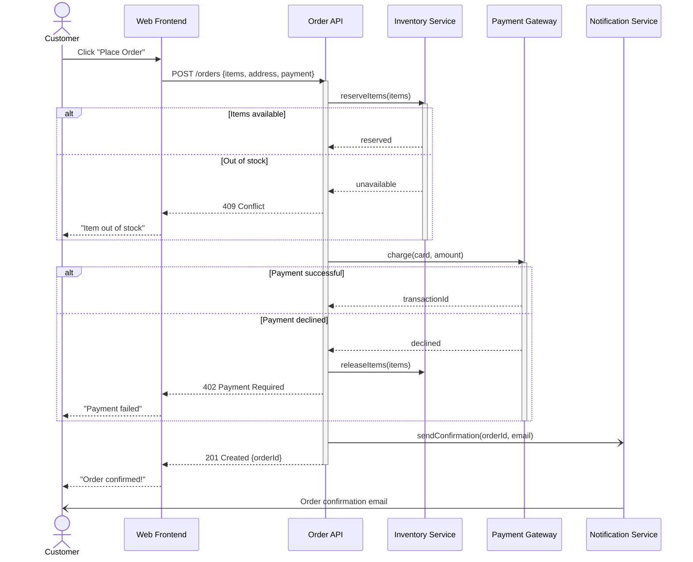

# Sequence Diagrams: A Complete Guide

A **sequence diagram** (German: *Sequenzdiagramm*) is one of the most widely used UML interaction diagrams. It shows how processes or objects communicate with each other over time by exchanging messages in a defined order. Unlike static structure diagrams (such as class diagrams), sequence diagrams capture **dynamic behavior** -- making them invaluable for understanding workflows, API interactions, and complex business processes.

## When to Use Sequence Diagrams

Sequence diagrams are the right tool when you need to:

- Model the **flow of messages** between system components for a specific use case
- Document **API call chains** across services (especially in microservice architectures)
- Clarify **asynchronous behavior**, callbacks, and event-driven flows
- Communicate **business processes** to stakeholders who need to understand the "who talks to whom and when"
- Verify that the design fulfills a particular **scenario or requirement**

## Legend: The Full UML Notation

Understanding the notation is essential before drawing or reading sequence diagrams. Below is a complete reference of all standard elements.

### Actors and Participants

| Element | Symbol | Description |
|---------|--------|-------------|
| **Actor** | Stick figure | A human user or an external system that initiates or participates in the interaction |
| **Participant (Object)** | Rectangle with name | A system component, class instance, or service involved in the interaction |
| **Lifeline** | Dashed vertical line | Extends downward from each participant, representing the passage of time |
| **Activation Bar** | Thin rectangle on lifeline | Indicates the period during which a participant is actively processing |

### Message Types

Messages are the core of sequence diagrams. UML defines several types:

| Arrow Style | Meaning | Mermaid Syntax |
|-------------|---------|----------------|
| **Solid line, filled arrowhead** →  | Synchronous message (caller waits for response) | `->>` |
| **Dashed line, filled arrowhead** ⇢ | Synchronous return message | `-->>` |
| **Solid line, open arrowhead** → | Asynchronous message (caller does not wait) | `-)` |
| **Dashed line, open arrowhead** ⇢ | Asynchronous return | `--)` |
| **Solid line with X** | Lost message (never arrives) | `-x` |
| **Dashed line with X** | Lost return | `--x` |

### Self-Messages

A participant can send a message to itself. This represents internal processing, recursive calls, or method invocations within the same object.

### Combined Fragments

Combined fragments group messages under a certain condition or control structure. They are drawn as labeled rectangles that enclose part of the diagram.

| Fragment | Keyword | Purpose |
|----------|---------|---------|
| **Alternative** | `alt` / `else` | If-else branching -- only one path executes |
| **Option** | `opt` | Executes only if a condition is true (like `if` without `else`) |
| **Loop** | `loop` | Repeats the enclosed messages while a condition holds |
| **Parallel** | `par` | Messages execute concurrently |
| **Critical** | `critical` | A critical region that must not be interrupted |
| **Break** | `break` | Exits the enclosing fragment early if a condition is met |

### Notes

Notes provide additional context or clarification. They can be placed to the left, right, or spanning over multiple participants.

### Create and Destroy

In UML, you can show the creation and destruction of participants during the interaction.

### Interaction References (ref)

When a diagram becomes complex, you can extract sub-interactions into separate diagrams and reference them with a **ref** fragment. This is equivalent to calling a subroutine. In Mermaid, you can approximate this with a `rect` block and a note:

## How to Create a Sequence Diagram: Step by Step

### Step 1: Identify the Scenario

Start with a concrete use case or user story. A sequence diagram should capture **one specific interaction flow**, not the entire system. Good starting points are:

- "User places an order"
- "System processes a payment"
- "Scheduler triggers a nightly report"

### Step 2: Identify the Participants

List every actor and system component involved in this scenario. Be specific: use service names, class names, or role names rather than vague labels. Order them from left to right following the typical flow direction (initiator on the left, downstream systems on the right).

### Step 3: Map Out the Messages

Walk through the scenario chronologically and identify each message exchange:

1. Who sends the message?
2. Who receives it?
3. Is it synchronous or asynchronous?
4. What data does it carry?

### Step 4: Add Control Logic

Once the basic message flow is in place, add combined fragments where the behavior branches or loops:

- Where does the system make decisions? → Use `alt`/`else`
- Where does behavior repeat? → Use `loop`
- Where do things happen in parallel? → Use `par`

### Step 5: Annotate with Notes

Add notes to clarify non-obvious aspects: preconditions, side effects, protocol details, or timing constraints. Keep notes short.

### Step 6: Review and Simplify

Read the diagram from top to bottom. Ask:

- Can a teammate understand this without additional explanation?
- Are there too many participants? (Consider splitting into multiple diagrams.)
- Are messages named clearly enough?

## Practical Example: E-Commerce Checkout

Here is a realistic sequence diagram for an e-commerce checkout flow:

## Best Practices

### 1. One Diagram, One Scenario

Each sequence diagram should model **a single use case or scenario**. Trying to capture all possible flows in one diagram leads to unreadable spaghetti. Use separate diagrams for the happy path, error cases, and edge cases, or use combined fragments sparingly.

### 2. Limit the Number of Participants

Keep participants to **5-7 per diagram**. If you need more, the interaction is likely complex enough to split into multiple diagrams connected by interaction references (`ref`).

### 3. Name Messages Like Method Calls

Use descriptive, verb-based message names that convey intent: `createOrder(items)`, `validateToken(jwt)`, `sendNotification(email)`. Avoid vague names like "data", "request", or "response". Include key parameters when they aid understanding.

### 4. Always Show Return Messages

Even though return messages are technically optional in UML, always include them. They make the diagram easier to follow and explicitly show what each caller receives back, including error responses.

### 5. Use Activation Bars Consistently

Activation bars clarify when a participant is actively processing. Use them to show the scope of synchronous operations. Avoid leaving them on for the entire diagram -- they should reflect actual processing time.

### 6. Read Top-to-Bottom, Left-to-Right

Arrange participants so the initiator is on the left and the flow moves rightward. Time flows strictly downward. This matches natural reading direction and makes the diagram intuitive.

### 7. Distinguish Synchronous from Asynchronous

Use the correct arrow types to differentiate synchronous calls (the sender blocks) from asynchronous messages (fire-and-forget). This distinction is critical for understanding system behavior, especially in distributed architectures.

### 8. Keep It at the Right Abstraction Level

Avoid modeling every getter, setter, or internal method call. Focus on **interactions between components**, not the internals of a single component. If implementation details matter, create a separate, more detailed diagram.

### 9. Annotate with Notes for Context

Use notes to document preconditions, invariants, SLAs, or protocol specifics that cannot be conveyed by the message flow alone. Place them close to the relevant interaction.

### 10. Version Control Your Diagrams

Use text-based diagram tools like **Mermaid**, **PlantUML**, or **Structurizr** so your diagrams live alongside your code in version control. This makes them easy to update, review in pull requests, and keep in sync with the codebase.

## Tools for Creating Sequence Diagrams

| Tool | Type | Strengths |
|------|------|-----------|
| **Mermaid** | Text-based, renders in Markdown | Integrates with GitHub, GitLab, Confluence, and many static site generators |
| **PlantUML** | Text-based, needs a renderer | Full UML support, mature ecosystem, IDE plugins |
| **Structurizr** | Code-based (C4 + diagrams) | Architecture-as-code approach, great for C4 models |
| **draw.io / diagrams.net** | Visual editor | Free, drag-and-drop, exports to many formats |
| **Lucidchart** | Visual editor (SaaS) | Collaborative real-time editing, polished UI |
| **Enterprise Architect** | Full UML suite | Comprehensive modeling for large organizations |

## Conclusion

Sequence diagrams are one of the most effective tools for communicating how components in a system interact over time. Their strength lies in their simplicity: participants on the top, time flowing downward, and messages connecting the two. By following the notation conventions and best practices outlined in this guide, you can create diagrams that are both precise enough for developers and clear enough for stakeholders. Keep them focused, keep them up to date, and let them live in your codebase alongside the code they describe.

## References

- [UML 2.5.1 Specification (OMG)](https://www.omg.org/spec/UML/2.5.1/)
- [Mermaid Sequence Diagram Syntax](https://mermaid.js.org/syntax/sequenceDiagram.html)
- [PlantUML Sequence Diagram Reference](https://plantuml.com/sequence-diagram)
- [Martin Fowler: UML Distilled (Chapter on Sequence Diagrams)](https://martinfowler.com/books/uml.html)
