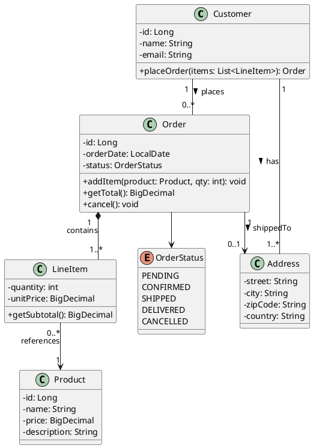
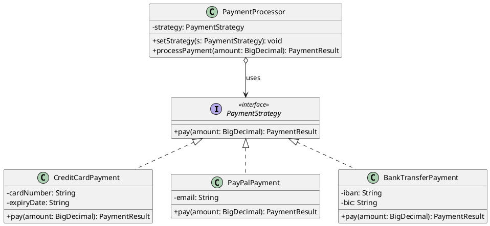
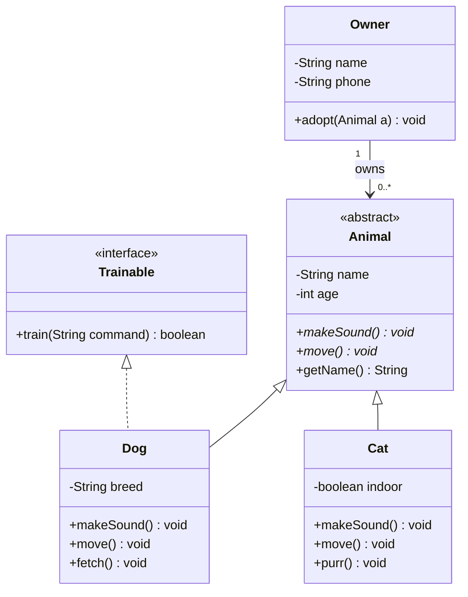
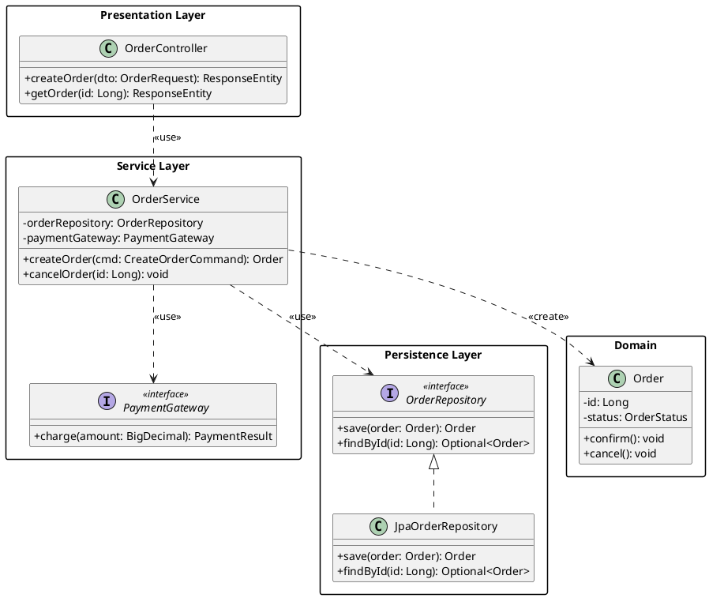

# UML Class Diagrams (Klassendiagramm): A Complete Guide

The **class diagram** (German: *Klassendiagramm*) is the most widely used UML diagram type and the foundation of object-oriented modeling. It describes the **static structure** of a system by showing its classes, their attributes and operations, and the relationships between them. If you learn only one UML diagram, make it this one — every other structure diagram builds on the concepts introduced here.

## What Is a Class Diagram?

A class diagram models the **types** that exist in a system and how they relate to each other. It answers questions like:

- What entities does the system manage?
- What data does each entity hold?
- What behavior does each entity expose?
- How are entities connected — through inheritance, composition, association, or dependency?

Class diagrams are **static** — they show what exists, not what happens at runtime. For dynamic behavior, use [sequence diagrams](/architecture/uml/2026/02/27/sequence-diagrams-guide.html) or activity diagrams.

## When to Use Class Diagrams

Class diagrams are the right tool when you need to:

- **Model the domain** — capture the key concepts and relationships of your business domain (Domain-Driven Design)
- **Design the architecture** — define interfaces, abstract classes, and the dependency structure between modules
- **Document APIs** — show which classes are public, what they expose, and how they relate
- **Plan a refactoring** — visualize the current structure and the target structure side by side
- **Communicate with the team** — give developers and architects a shared vocabulary and a visual reference
- **Prepare for code generation** — tools like Enterprise Architect and StarUML can generate code skeletons from class diagrams

## The Complete Legend

Understanding every notation element is essential before drawing or reading class diagrams. Below is a comprehensive reference.

### The Class Box

A class is drawn as a rectangle divided into three compartments:

```
┌──────────────────────────────┐
│        <<stereotype>>        │  ← optional stereotype (e.g., <<entity>>)
│         ClassName            │  ← class name (bold, centered)
├──────────────────────────────┤
│ - id: Long                   │  ← attributes (fields)
│ - name: String               │
│ # status: Status             │
│ + email: String              │
├──────────────────────────────┤
│ + getName(): String          │  ← operations (methods)
│ + setName(n: String): void   │
│ - validate(): boolean        │
└──────────────────────────────┘
```

Each compartment has a specific role:

| Compartment | Content | Required? |
|---|---|---|
| **Top** | Class name and optional stereotype | Yes |
| **Middle** | Attributes (name, type, visibility, default value) | Optional — can be hidden |
| **Bottom** | Operations (name, parameters, return type, visibility) | Optional — can be hidden |

When space is limited or details are unnecessary, you can omit the middle or bottom compartments entirely, showing only the class name.

### Visibility Modifiers

Every attribute and operation carries a visibility symbol as its first character:

| Symbol | Visibility | UML Keyword | Meaning |
|--------|-----------|-------------|---------|
| `+` | Public | `public` | Accessible from any class |
| `-` | Private | `private` | Accessible only within the declaring class |
| `#` | Protected | `protected` | Accessible within the class and its subclasses |
| `~` | Package | `package` | Accessible within the same package (Java) or namespace |

**Example:**

```
┌─────────────────────────────┐
│         BankAccount         │
├─────────────────────────────┤
│ - accountNumber: String     │
│ - balance: BigDecimal       │
│ # overdraftLimit: BigDecimal│
│ + owner: String             │
├─────────────────────────────┤
│ + deposit(amount): void     │
│ + withdraw(amount): boolean │
│ - logTransaction(): void    │
│ # checkLimit(): boolean     │
└─────────────────────────────┘
```

### Attribute Notation (Full Syntax)

The complete UML syntax for an attribute is:

```
visibility name : type [multiplicity] = defaultValue {property}
```

| Part | Example | Meaning |
|------|---------|---------|
| Visibility | `-` | Private |
| Name | `balance` | Field name |
| Type | `BigDecimal` | Data type |
| Multiplicity | `[0..*]` | Collection of zero or more |
| Default value | `= 0.00` | Initial value |
| Property | `{readOnly}` | Constraint (readOnly, ordered, unique) |

**Full example:** `- balance : BigDecimal = 0.00 {readOnly}`

### Operation Notation (Full Syntax)

The complete UML syntax for an operation is:

```
visibility name (parameterList) : returnType {property}
```

**Parameter syntax:** `direction name : type = defaultValue`

| Direction | Meaning |
|-----------|---------|
| `in` | Input parameter (default, usually omitted) |
| `out` | Output parameter |
| `inout` | Parameter that is both read and modified |
| `return` | Return value (rarely used explicitly) |

**Full example:** `+ transfer(in amount: BigDecimal, in target: BankAccount): boolean`

### Static Members (Class-Level)

Static attributes and operations are shown with an **underline**:

```
┌──────────────────────────────┐
│        MathUtils             │
├──────────────────────────────┤
│ + PI: double = 3.14159       │  ← underlined = static
├──────────────────────────────┤
│ + max(a: int, b: int): int  │  ← underlined = static
└──────────────────────────────┘
```

In text-based tools, static members are typically annotated with `{static}` or rendered with underline formatting.

### Abstract Classes and Methods

- An **abstract class** has its name in *italics*.
- An **abstract method** has its signature in *italics*.
- Alternatively, the `{abstract}` tag can be appended.

```
┌──────────────────────────────┐
│       «abstract»             │
│        Shape                 │  ← italicized name
├──────────────────────────────┤
│ # color: Color               │
├──────────────────────────────┤
│ + area(): double             │  ← italicized = abstract
│ + perimeter(): double        │  ← italicized = abstract
│ + getColor(): Color          │  ← concrete (not italicized)
└──────────────────────────────┘
```

### Interfaces

An interface is drawn like a class with the `<<interface>>` stereotype:

```
┌──────────────────────────────┐
│       <<interface>>          │
│        Comparable<T>         │
├──────────────────────────────┤
│                              │
├──────────────────────────────┤
│ + compareTo(other: T): int  │
└──────────────────────────────┘
```

Alternatively, UML provides **lollipop notation** for compact diagrams:

```
                ○ Comparable       ← provided interface (lollipop)
                │
┌───────────────┴──────────────┐
│          Product             │
└──────────────────────────────┘
```

And **socket notation** for required interfaces:

```
┌───────────────┐
│   OrderService│──────◠ PaymentGateway    ← required interface (socket)
└───────────────┘
```

### Enumerations

Enumerations use the `<<enumeration>>` stereotype:

```
┌──────────────────────────────┐
│       <<enumeration>>        │
│         OrderStatus          │
├──────────────────────────────┤
│ PENDING                      │
│ CONFIRMED                    │
│ SHIPPED                      │
│ DELIVERED                    │
│ CANCELLED                    │
└──────────────────────────────┘
```

### Data Types and Primitives

Primitive types or value objects can use the `<<datatype>>` or `<<primitive>>` stereotypes:

```
┌──────────────────────────────┐
│        <<datatype>>          │
│          Address             │
├──────────────────────────────┤
│ + street: String             │
│ + city: String               │
│ + zipCode: String            │
│ + country: String            │
└──────────────────────────────┘
```

---

## Relationships

Relationships are the backbone of class diagrams. Each type has a distinct line style, arrowhead, and semantic meaning.

### Association

A **structural link** between two classes indicating that instances of one are connected to instances of the other.

```
┌──────────┐                    ┌──────────┐
│ Customer │────────────────────│  Order   │
└──────────┘                    └──────────┘
```

- **Solid line**, optionally with arrowheads, role names, and multiplicities.
- Reads as: "A Customer is associated with an Order."

### Directed Association (Navigability)

When only one class knows about the other, use an **open arrowhead** to show the direction of navigation:

```
┌──────────┐                    ┌──────────┐
│  Order   │───────────────────>│ Product  │
└──────────┘                    └──────────┘
```

- Order knows about Product, but Product does not know about Order.

### Bidirectional Association

When both classes hold a reference to each other:

```
┌──────────┐                    ┌──────────┐
│ Student  │<──────────────────>│  Course  │
└──────────┘                    └──────────┘
```

### Association with Roles and Multiplicity

Roles and multiplicities add precision:

```
         employer        employee
┌──────────┐ 1       0..* ┌──────────┐
│ Company  │──────────────│  Person  │
└──────────┘              └──────────┘
```

- A Company (in the role of employer) employs zero or more Persons (in the role of employee).
- Each Person works for exactly one Company.

### Multiplicity Notation

| Symbol | Meaning |
|--------|---------|
| `1` | Exactly one |
| `0..1` | Zero or one (optional) |
| `*` or `0..*` | Zero or more |
| `1..*` | One or more |
| `n..m` | From n to m (e.g., `2..5`) |
| `n` | Exactly n |

### Association Class

When an association itself carries attributes or operations, it is modeled as an **association class** — a class connected to the association line with a dashed line:

```
┌──────────┐              ┌──────────┐
│ Student  │──────────────│  Course  │
└──────────┘      │       └──────────┘
                  ┆
            ┌─────┴──────┐
            │ Enrollment │
            ├────────────┤
            │ - grade    │
            │ - date     │
            └────────────┘
```

The `Enrollment` class exists because of the association between Student and Course and carries data (grade, date) that belongs to neither Student nor Course alone.

### Aggregation (Weak "Has-A")

A special form of association representing a **whole-part** relationship where the part can exist independently of the whole.

```
┌──────────┐              ┌──────────┐
│   Team   │◇─────────────│  Player  │
└──────────┘              └──────────┘
```

- **Solid line with an empty (white) diamond** on the whole side.
- A Player can exist without a Team (they can be a free agent).

### Composition (Strong "Has-A")

A stronger form of aggregation where the part **cannot exist** without the whole. When the whole is destroyed, so are its parts.

```
┌──────────┐              ┌──────────┐
│  Invoice │◆─────────────│ LineItem │
└──────────┘              └──────────┘
```

- **Solid line with a filled (black) diamond** on the whole side.
- A LineItem has no meaning without its Invoice. Deleting the Invoice deletes all its LineItems.

### Generalization (Inheritance)

Represents the "is-a" relationship — a subclass inherits the attributes and operations of its superclass.

```
        ┌──────────┐
        │  Vehicle  │
        └─────▲────┘
              │
     ┌────────┼────────┐
     │                  │
┌────┴─────┐      ┌────┴─────┐
│   Car    │      │  Truck   │
└──────────┘      └──────────┘
```

- **Solid line with a closed, hollow (white) triangle** pointing at the superclass.
- Car **is-a** Vehicle. Truck **is-a** Vehicle.

### Realization (Interface Implementation)

Represents a class implementing an interface contract.

```
┌────────────────┐
│ <<interface>>  │
│   Serializable │
└───────▲────────┘
        ┆
┌───────┴────────┐
│   UserDTO      │
└────────────────┘
```

- **Dashed line with a closed, hollow triangle** pointing at the interface.
- UserDTO **implements** Serializable.

### Dependency

A weaker relationship where one class **uses** another temporarily — for example, as a method parameter, local variable, or return type.

```
┌──────────┐              ┌──────────┐
│ Controller│ - - - - - ->│  Service │
└──────────┘              └──────────┘
```

- **Dashed line with an open arrowhead**.
- Common stereotypes: `<<use>>`, `<<create>>`, `<<call>>`, `<<instantiate>>`.

### Relationship Summary Table

| Relationship | Line Style | Arrowhead | Diamond | Keyword | Meaning |
|---|---|---|---|---|---|
| Association | Solid | None or open | — | — | Structural link |
| Directed Association | Solid | Open → | — | — | One-way navigation |
| Aggregation | Solid | — | ◇ (empty) | — | Weak "has-a" (part can exist alone) |
| Composition | Solid | — | ◆ (filled) | — | Strong "has-a" (part dies with whole) |
| Generalization | Solid | △ (hollow) | — | extends | Inheritance ("is-a") |
| Realization | Dashed | △ (hollow) | — | implements | Interface implementation |
| Dependency | Dashed | → (open) | — | uses | Temporary usage |

---

## Packages and Namespaces

Classes can be grouped into **packages**, shown as tabbed rectangles:

```
┌─────────────────────────────────────┐
│ com.example.order                   │
├─────────────────────────────────────┤
│                                     │
│  ┌───────────┐    ┌───────────┐    │
│  │   Order   │    │ LineItem  │    │
│  └───────────┘    └───────────┘    │
│                                     │
└─────────────────────────────────────┘
```

Packages can depend on each other, shown with dashed dependency arrows between the package rectangles.

---

## Constraints and Notes

### Constraints

Constraints are conditions written in curly braces `{ }` attached to elements:

- `{readOnly}` — attribute cannot be changed after initialization
- `{ordered}` — collection maintains insertion order
- `{unique}` — no duplicate elements in the collection
- `{frozen}` — value is set once and never changes
- `{xor}` — only one of several associations can exist at a time

### Notes

A note is a rectangle with a folded corner, connected to an element with a dashed line:

```
┌──────────────────┐
│   Order          │
├──────────────────┤    ┌ ─ ─ ─ ─ ─ ─ ─ ─ ─ ┐
│ - total          │----  Total is calculated  │
│                  │    │ as sum of line items  │
└──────────────────┘    └ ─ ─ ─ ─ ─ ─ ─ ─ ─ ┘
```

---

## How to Create a Class Diagram: Step by Step

### Step 1: Define the Purpose and Scope

Before drawing, answer these questions:

- **What question does this diagram answer?** A diagram without a purpose is visual noise.
- **Who is the audience?** A domain model for business analysts differs from a detailed design for developers.
- **What is the scope?** Limit the diagram to one module, one bounded context, or one feature. A class diagram of the entire system is useless.

### Step 2: Identify the Classes

Start with the **nouns** in your requirements, user stories, or domain description:

- "A **Customer** places an **Order** containing one or more **LineItems**. Each LineItem references a **Product**."
- Nouns → Candidate classes: Customer, Order, LineItem, Product.

Filter out:

- Nouns that are really attributes (e.g., "name" is an attribute of Customer, not a separate class)
- Nouns that are outside the diagram's scope

### Step 3: Define Attributes and Operations

For each class, list:

- **Attributes**: the data the class holds. Include types and visibility.
- **Operations**: the behavior the class exposes. Include parameters, return types, and visibility.

Only include attributes and operations that are relevant to the diagram's purpose. Omit trivial getters, setters, and framework-generated methods.

### Step 4: Identify Relationships

Walk through the requirements again and look for:

- **"has-a"** relationships → Association, Aggregation, or Composition
- **"is-a"** relationships → Generalization
- **"implements"** → Realization
- **"uses"** → Dependency

For each association, determine:

- **Navigability**: Does Class A know about Class B, or both?
- **Multiplicity**: How many instances of B can A reference?
- **Role names**: What role does each class play in the relationship?

### Step 5: Choose a Tool

| Tool | Type | Strengths |
|------|------|-----------|
| [PlantUML](https://plantuml.com/) | Text-to-diagram | Diagrams as code, excellent for version control |
| [Mermaid](https://mermaid.js.org/) | Text-to-diagram | Renders in GitHub, GitLab, Confluence, Notion |
| [draw.io / diagrams.net](https://app.diagrams.net/) | GUI editor | Free, drag-and-drop, exports to SVG/PNG |
| [Lucidchart](https://www.lucidchart.com/) | GUI editor (SaaS) | Real-time collaboration |
| [StarUML](https://staruml.io/) | Desktop IDE | Full UML 2.x support, code generation |
| [Enterprise Architect](https://sparxsystems.com/) | Enterprise tool | Round-trip engineering, large-scale modeling |

### Step 6: Draw the Diagram

Start with the most important classes, add relationships, then add detail incrementally. Place parent classes above children and group related classes spatially.

### Step 7: Review and Iterate

Walk through the diagram with your team. Verify accuracy, check that multiplicities and role names are correct, and remove anything that does not serve the diagram's stated purpose.

---

## Practical Examples

### Example 1: E-Commerce Domain Model (PlantUML)



### Example 2: Design Patterns — Strategy Pattern (PlantUML)



### Example 3: Simple Class Diagram (Mermaid)



### Example 4: Layered Architecture (PlantUML)



---

## Best Practices

### 1. One Diagram, One Purpose

Each class diagram should answer **one specific question** or model **one bounded area** of the system. A domain model diagram has a different purpose than a detailed design diagram or a dependency analysis diagram. Do not try to capture everything in a single diagram — create multiple focused diagrams instead.

### 2. Choose the Right Level of Detail

Match the detail to your audience and purpose:

| Audience | Level of Detail |
|----------|-----------------|
| Business analysts, product managers | Class names and key relationships only (conceptual model) |
| Software architects | Classes, key attributes, interfaces, packages, and dependencies |
| Developers | Full attributes, operations, visibility, types, and constraints |

Hiding or showing compartments is a valid modeling decision — an empty attribute or operation compartment does not mean the class has none.

### 3. Use Composition vs. Aggregation Correctly

This is the most commonly misused distinction in UML:

- **Composition** (filled diamond ◆): The part **cannot exist** without the whole. Deleting the whole cascades to the parts. Example: A `Room` cannot exist without a `House`.
- **Aggregation** (empty diamond ◇): The part **can exist** independently. Example: A `Player` can exist without a `Team`.
- **When in doubt, use a plain association.** Aggregation is semantically weak in UML, and many modeling experts (including Martin Fowler) recommend avoiding it entirely unless the distinction genuinely matters.

### 4. Always Specify Multiplicities

Bare association lines are ambiguous. Always annotate multiplicities on both ends:

```
Customer "1" ──── "0..*" Order
```

This removes ambiguity: one Customer can have zero or more Orders, and each Order belongs to exactly one Customer.

### 5. Use Role Names for Clarity

When the relationship purpose is not obvious from the class names, add role names:

```
         manager           subordinate
Person "1" ──────────── "0..*" Person
```

Without role names, a self-association on `Person` is unreadable.

### 6. Minimize Crossing Lines

Crossing lines make diagrams hard to read. To avoid them:

- Place parent classes above their children.
- Place closely related classes near each other.
- Use the `linetype ortho` setting in PlantUML for orthogonal (right-angle) routing.
- If a diagram has too many crossings, split it into multiple diagrams.

### 7. Apply the Dependency Inversion Principle Visually

High-level modules should not depend on low-level modules. In your class diagram, this means arrows from concrete classes should point **toward** abstractions (interfaces, abstract classes), not the other way around. If most dependency arrows point downward toward interfaces, your architecture is well-structured.

### 8. Show Only Relevant Details

Omit:

- Trivial getters and setters (unless they have non-trivial logic)
- Framework-generated methods (`toString()`, `hashCode()`, `equals()`)
- Utility classes that do not contribute to the diagram's message
- Implementation details that belong in a more detailed diagram

### 9. Use Color and Stereotypes Intentionally

Color and stereotypes help readers parse the diagram quickly:

| Color Suggestion | Meaning |
|-----------------|---------|
| Blue | Domain / entity classes |
| Green | Service / use case classes |
| Yellow | DTOs / value objects |
| Gray | Infrastructure / framework classes |
| Pink / Red | External systems or interfaces |

Stereotypes like `<<entity>>`, `<<service>>`, `<<repository>>`, `<<controller>>`, and `<<valueObject>>` make the role of each class explicit without requiring color.

### 10. Keep Diagrams in Version Control

Use text-based tools like **PlantUML** or **Mermaid** so your class diagrams are stored as code alongside the source. This enables:

- **Diffing** — see what changed in a diagram between commits
- **Code review** — diagram changes are part of pull requests
- **Automation** — generate diagrams in CI/CD pipelines
- **Single source of truth** — diagrams and code evolve together

### 11. Validate Against the Code

A class diagram that contradicts the code is worse than no diagram at all. Periodically validate your diagrams:

- Use IDE plugins (e.g., PlantUML integration in IntelliJ) to reverse-engineer diagrams from code.
- Use tools like [Spring Modulith](/architecture/spring/2026/02/27/deep-dive-spring-modulith-part-1.html) to auto-generate module dependency diagrams.
- Review diagrams as part of code reviews — if the code changed but the diagram did not, update it or delete it.

### 12. Avoid Common Mistakes

| Mistake | Why It's Wrong | Fix |
|---------|---------------|-----|
| Using composition everywhere | Implies parts die with the whole; usually too strong | Use association or aggregation unless the lifecycle dependency is real |
| Omitting multiplicities | Creates ambiguity about how many instances participate | Always specify both ends |
| Mixing abstraction levels | Confuses the reader (packages next to private fields) | Keep each diagram at one level |
| Drawing every class in the system | Produces an unreadable wall of boxes | Limit scope to one module or feature |
| Using dependency where association is correct | A dependency is temporary; an association implies a structural reference | If Class A holds a field of type B, that is an association, not a dependency |
| Arrows pointing the wrong way | Generalization arrows point to the parent, not the child | Remember: the triangle always points at the supertype |

---

## Quick Reference Cheat Sheet

```
RELATIONSHIPS AT A GLANCE
───────────────────────────────────────────────────

  A ──────── B        Association
  A ───────> B        Directed Association (A → B)
  A ◇─────── B        Aggregation  (A has B, B can exist alone)
  A ◆─────── B        Composition  (A owns B, B dies with A)
  A ────▷    B        Generalization  (A extends B)
  A ----▷    B        Realization  (A implements B)
  A -------> B        Dependency  (A uses B temporarily)

VISIBILITY
───────────────────────────────────────────────────
  +  public       -  private
  #  protected    ~  package

MULTIPLICITY
───────────────────────────────────────────────────
  1       exactly one        0..1    optional
  *       zero or more       1..*    one or more
  n..m    range              n       exactly n

CLASS MODIFIERS
───────────────────────────────────────────────────
  «abstract»       Abstract class (name in italics)
  «interface»      Interface
  «enumeration»    Enumeration
  «entity»         Persistent domain object
  «service»        Stateless service
  «repository»     Data access object
  underlined       Static member
  italicized       Abstract member
```

## Conclusion

The class diagram is the lingua franca of object-oriented design. It bridges the gap between abstract requirements and concrete code by providing a visual, standardized way to describe structure, relationships, and constraints. Its power lies not in drawing every class and every field, but in **selecting the right elements** for the **right audience** to communicate a specific design decision or domain concept. Master the notation, apply it with discipline, and keep your diagrams focused, accurate, and close to the code they describe.

## References

- [UML 2.5.1 Specification — OMG](https://www.omg.org/spec/UML/2.5.1/About-UML)
- [PlantUML Class Diagram Reference](https://plantuml.com/class-diagram)
- [Mermaid Class Diagram Syntax](https://mermaid.js.org/syntax/classDiagram.html)
- [Martin Fowler: UML Distilled — Addison-Wesley](https://martinfowler.com/books/uml.html)
- [draw.io / diagrams.net](https://app.diagrams.net/)
- [StarUML — UML Modeling Tool](https://staruml.io/)
- [Enterprise Architect — Sparx Systems](https://sparxsystems.com/)
