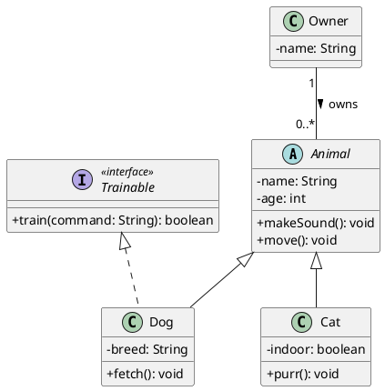
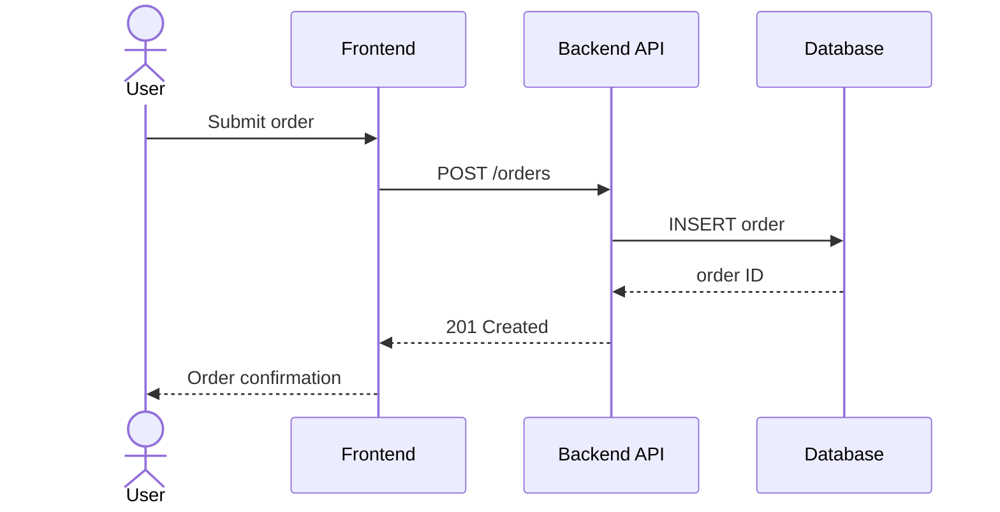

# UML Diagrams: A Comprehensive Guide to the Legend and Best Practices

The **Unified Modeling Language (UML)** is the industry-standard visual language for specifying, constructing, and documenting the artifacts of software systems. Whether you are sketching a quick class diagram on a whiteboard or producing formal models for a safety-critical system, understanding UML's notation and applying it correctly is a fundamental skill for software architects and developers.

## What Is UML?

UML was created in the mid-1990s by Grady Booch, James Rumbaugh, and Ivar Jacobson — often called the "Three Amigos" — at Rational Software. It unified several competing notations into a single standard, which is now maintained by the [Object Management Group (OMG)](https://www.omg.org/spec/UML/). The current version is **UML 2.5.1**.

UML is **not** a programming language. It is a **modeling language** that provides a set of diagrams for visualizing different aspects of a system. It is technology-agnostic and can be applied to any object-oriented (and even non-OO) system.

## UML Diagram Categories

UML defines **14 diagram types** organized into two main categories:

### Structure Diagrams (Static View)

These diagrams model the **static** aspects of a system — the things that exist and their relationships.

| Diagram | Purpose |
|---|---|
| **Class Diagram** | Shows classes, attributes, operations, and relationships |
| **Object Diagram** | Shows instances of classes at a specific point in time |
| **Package Diagram** | Groups elements into packages and shows dependencies |
| **Component Diagram** | Models the physical components (JARs, DLLs, services) and their interfaces |
| **Deployment Diagram** | Maps software artifacts to hardware nodes |
| **Composite Structure Diagram** | Shows the internal structure of a class or component |
| **Profile Diagram** | Extends the UML metamodel for specific domains |

### Behavior Diagrams (Dynamic View)

These diagrams model **how** the system behaves over time.

| Diagram | Purpose |
|---|---|
| **Use Case Diagram** | Captures functional requirements from the user's perspective |
| **Activity Diagram** | Models workflows, business processes, and algorithms |
| **State Machine Diagram** | Shows the states of an object and transitions between them |
| **Sequence Diagram** | Shows object interactions ordered by time |
| **Communication Diagram** | Shows object interactions emphasizing links |
| **Timing Diagram** | Shows behavior changes along a time axis |
| **Interaction Overview Diagram** | Combines activity and sequence diagrams at a high level |

## The UML Legend: Symbols and Notation

Understanding UML's visual vocabulary is essential. Below is the complete reference for the most commonly used elements.

### Classes and Interfaces

A **class** is drawn as a rectangle divided into three compartments:

```
┌──────────────────────────┐
│       <<stereotype>>     │  ← optional stereotype
│        ClassName         │  ← class name (bold, centered)
├──────────────────────────┤
│ - privateAttr: Type      │  ← attributes
│ # protectedAttr: Type    │
│ + publicAttr: Type       │
│ ~ packageAttr: Type      │
├──────────────────────────┤
│ + publicMethod(): RetVal │  ← operations
│ - privateMethod(): void  │
└──────────────────────────┘
```

**Visibility modifiers:**

| Symbol | Meaning |
|--------|---------|
| `+` | Public |
| `-` | Private |
| `#` | Protected |
| `~` | Package / Default |

**Interfaces** are shown like a class with the `<<interface>>` stereotype above the name, or as a small circle (lollipop notation) when showing a provided interface.

**Abstract classes** have their name in *italics*. Abstract methods are also italicized.

### Relationships

Relationships are the backbone of UML diagrams. Each has a distinct line style and arrowhead.

#### Association

A structural link between two classes indicating that instances of one class are connected to instances of another.

```
┌─────────┐          ┌─────────┐
│ ClassA  │──────────│ ClassB  │
└─────────┘          └─────────┘
```

- **Solid line**, optionally with an open arrowhead for navigability.
- Can carry a **role name**, **multiplicity**, and **association name**.

#### Multiplicity Notation

| Symbol | Meaning |
|--------|---------|
| `1` | Exactly one |
| `0..1` | Zero or one |
| `*` or `0..*` | Zero or more |
| `1..*` | One or more |
| `n..m` | From n to m |

#### Directed Association

```
┌─────────┐          ┌─────────┐
│  Order  │─────────>│ Product │
└─────────┘          └─────────┘
```

- **Solid line with an open arrowhead** — indicates the direction of navigation (Order knows about Product, but not vice versa).

#### Aggregation (Has-A, Weak Ownership)

```
┌─────────┐          ┌─────────┐
│  Team   │◇─────────│ Player  │
└─────────┘          └─────────┘
```

- **Solid line with an empty (white) diamond** on the owner side.
- The part (Player) can exist independently of the whole (Team).

#### Composition (Has-A, Strong Ownership)

```
┌─────────┐          ┌─────────┐
│  House  │◆─────────│  Room   │
└─────────┘          └─────────┘
```

- **Solid line with a filled (black) diamond** on the owner side.
- The part (Room) cannot exist without the whole (House). When the whole is destroyed, so are its parts.

#### Generalization (Inheritance)

```
┌─────────┐
│ Animal  │
└────▲────┘
     │
┌────┴────┐
│   Dog   │
└─────────┘
```

- **Solid line with a closed, hollow (white) triangle arrowhead** pointing at the parent.
- "Dog **is-a** Animal."

#### Realization (Interface Implementation)

```
┌────────────────┐
│ <<interface>>  │
│   Serializable │
└───────▲────────┘
        ┆
┌───────┴────────┐
│    MyClass     │
└────────────────┘
```

- **Dashed line with a closed, hollow triangle arrowhead** pointing at the interface.
- "MyClass **implements** Serializable."

#### Dependency

```
┌─────────┐          ┌─────────┐
│ ClassA  │ -------> │ ClassB  │
└─────────┘          └─────────┘
```

- **Dashed line with an open arrowhead**.
- A weaker relationship: ClassA *uses* ClassB (e.g., as a method parameter or local variable) but does not hold a permanent reference.

### Relationship Summary Table

| Relationship | Line Style | Arrowhead | Diamond | Meaning |
|---|---|---|---|---|
| Association | Solid | None or open | — | Structural link |
| Directed Association | Solid | Open → | — | One-way navigation |
| Aggregation | Solid | — | ◇ (empty) | Weak "has-a" |
| Composition | Solid | — | ◆ (filled) | Strong "has-a" |
| Generalization | Solid | △ (hollow) | — | Inheritance |
| Realization | Dashed | △ (hollow) | — | Implements interface |
| Dependency | Dashed | → (open) | — | Uses |

### Sequence Diagram Notation

Sequence diagrams model interactions over time. Key elements:

| Element | Symbol | Description |
|---|---|---|
| **Lifeline** | Dashed vertical line below an object box | Represents an object's existence over time |
| **Activation bar** | Thin rectangle on the lifeline | Period during which the object is active |
| **Synchronous message** | Solid line with filled arrowhead → | Caller waits for a response |
| **Asynchronous message** | Solid line with open arrowhead → | Caller does not wait |
| **Return message** | Dashed line with open arrowhead ← | Response back to the caller |
| **Self-message** | Arrow looping back to same lifeline | Object calls its own method |
| **Combined fragments** | Rectangle with operator label (alt, loop, opt, par) | Control flow within the sequence |

**Common combined fragment operators:**

| Operator | Meaning |
|---|---|
| `alt` | Alternative (if/else) |
| `opt` | Optional (if without else) |
| `loop` | Iteration |
| `par` | Parallel execution |
| `break` | Break out of enclosing fragment |
| `ref` | Reference to another interaction |

### Activity Diagram Notation

| Element | Symbol | Description |
|---|---|---|
| **Initial node** | Filled black circle ● | Start of the workflow |
| **Final node** | Filled circle inside a ring ◉ | End of the workflow |
| **Action** | Rounded rectangle | A single step or task |
| **Decision node** | Diamond ◇ | Branch with guard conditions |
| **Merge node** | Diamond ◇ | Joins alternative paths |
| **Fork bar** | Thick horizontal bar | Splits into parallel flows |
| **Join bar** | Thick horizontal bar | Synchronizes parallel flows |
| **Swimlane** | Vertical or horizontal partition | Groups actions by actor or component |

### State Machine Diagram Notation

| Element | Symbol | Description |
|---|---|---|
| **State** | Rounded rectangle | A condition or situation of an object |
| **Initial pseudostate** | Filled black circle ● | Starting point |
| **Final state** | Filled circle inside a ring ◉ | Terminal point |
| **Transition** | Arrow with label `event [guard] / action` | State change trigger |
| **Composite state** | State containing sub-states | Nested behavior |

### Use Case Diagram Notation

| Element | Symbol | Description |
|---|---|---|
| **Actor** | Stick figure | A role played by a user or external system |
| **Use Case** | Oval / ellipse | A piece of functionality |
| **System boundary** | Rectangle enclosing use cases | Scope of the system |
| **Association** | Solid line between actor and use case | Actor participates in use case |
| **Include** | Dashed arrow with `<<include>>` | Use case always invokes another |
| **Extend** | Dashed arrow with `<<extend>>` | Use case optionally extends another |
| **Generalization** | Solid line with hollow triangle | Specialization of an actor or use case |

### Package and Component Diagram Notation

| Element | Symbol | Description |
|---|---|---|
| **Package** | Folder icon (tabbed rectangle) | Grouping mechanism |
| **Component** | Rectangle with component icon (two small rectangles on left edge) | A modular, deployable unit |
| **Provided interface** | Lollipop (circle on a stick) | Interface the component offers |
| **Required interface** | Socket (half-circle) | Interface the component needs |
| **Port** | Small square on component edge | Interaction point |

### Common Stereotypes

Stereotypes extend UML's vocabulary using `<<...>>` guillemets:

| Stereotype | Applies To | Meaning |
|---|---|---|
| `<<interface>>` | Class | The classifier is an interface |
| `<<abstract>>` | Class | The class is abstract |
| `<<enumeration>>` | Class | The classifier is an enum |
| `<<entity>>` | Class | A persistent domain object |
| `<<service>>` | Class | A stateless service |
| `<<controller>>` | Class | Handles incoming requests |
| `<<repository>>` | Class | Data access object |
| `<<create>>` | Dependency | The source creates an instance of the target |
| `<<use>>` | Dependency | The source uses the target |

## How to Create a UML Diagram: Step by Step

### 1. Define the Purpose and Audience

Before drawing anything, answer these questions:

- **What decision or question does this diagram support?** A diagram without a purpose is visual noise.
- **Who will read it?** Developers need more technical detail than product managers.
- **Which diagram type is appropriate?** A class diagram is wrong for modeling a workflow; use an activity diagram instead.

### 2. Identify the Scope

Limit the diagram to a specific subsystem, feature, or scenario. A class diagram that shows every class in the system is useless — it is too large to read and too costly to maintain.

### 3. Gather the Elements

- For a **class diagram**: list the key classes, their attributes, operations, and relationships.
- For a **sequence diagram**: identify the actors, objects, and the messages they exchange for a specific scenario.
- For an **activity diagram**: outline the steps, decisions, and parallel paths.

### 4. Choose a Tool

| Tool | Type | Notes |
|---|---|---|
| [PlantUML](https://plantuml.com/) | Text-to-diagram | Write diagrams as code; great for version control |
| [Mermaid](https://mermaid.js.org/) | Text-to-diagram | Renders in Markdown (GitHub, GitLab, Notion) |
| [draw.io / diagrams.net](https://app.diagrams.net/) | GUI editor | Free, browser-based, exports to SVG/PNG |
| [Lucidchart](https://www.lucidchart.com/) | GUI editor | Collaborative, cloud-based |
| [StarUML](https://staruml.io/) | Desktop IDE | Full UML 2.x support |
| [Enterprise Architect](https://sparxsystems.com/) | Enterprise tool | Code generation, round-trip engineering |

### 5. Draw the Diagram

Start with the most important elements and add detail incrementally. Use the notations described in the legend above consistently.

**Example — Class Diagram in PlantUML:**



**Example — Sequence Diagram in Mermaid:**



### 6. Review and Iterate

Walk through the diagram with stakeholders. Check that it is accurate, complete for its stated purpose, and readable. Remove anything that does not contribute to the diagram's goal.

## Best Practices

### Keep It Simple

> "All models are wrong, but some are useful." — George E. P. Box

A UML diagram is not the code. It is a **communication tool**. Include only what is necessary to convey the message. Omit trivial getters/setters, utility classes, and implementation details that add clutter without insight.

### One Diagram, One Purpose

Each diagram should answer **one question** or illustrate **one scenario**. If a diagram tries to show everything, it shows nothing effectively. Create multiple focused diagrams rather than one overloaded one.

### Use Consistent Abstraction Levels

Do not mix high-level architecture (packages, components) with low-level implementation details (private fields, helper methods) in the same diagram. If you show a component diagram, keep it at the component level. Drill down into class diagrams separately.

### Apply Standard Notation Correctly

Using UML symbols incorrectly is worse than not using UML at all, because it creates false assumptions. Key rules to follow:

- **Composition vs. Aggregation**: Use composition (filled diamond) only when the part truly cannot exist without the whole. When in doubt, use association.
- **Generalization vs. Realization**: Solid lines for class inheritance, dashed lines for interface implementation. Mixing these up changes the meaning entirely.
- **Dependency direction**: Arrows point from the dependent class *toward* the class it depends on, not the other way around.

### Add Multiplicities and Role Names

Bare association lines are ambiguous. Always specify:
- **Multiplicity** (e.g., `1..*`, `0..1`) to clarify how many instances participate.
- **Role names** (e.g., `employer`, `employee`) when the relationship purpose is not obvious from the class names.

### Label Relationships Where Helpful

An association line labeled `<<manages>>` or `places >` communicates more than an unlabeled line. But do not over-label — if the relationship is self-evident from the class names, a label adds noise.

### Use Color and Layout Intentionally

- Group related classes spatially. Place parent classes above their children.
- Use color sparingly and consistently — for example, blue for domain classes, green for services, gray for infrastructure.
- Avoid crossing lines wherever possible. If a diagram has many crossing lines, reconsider the layout or split the diagram.

### Version Control Your Diagrams

Text-based tools like **PlantUML** and **Mermaid** produce diagrams from plain text files that can be stored in Git alongside the code. This makes diagrams diffable, reviewable, and part of the CI/CD pipeline.

### Keep Diagrams Close to the Code

Diagrams that live in a separate wiki or shared drive quickly become outdated. Store them in the repository, ideally generated from or validated against the actual source code. Tools like Spring Modulith (covered in a [previous post](/posts/spring-modular-modulith/)) can even auto-generate module diagrams from the codebase.

### Know When NOT to Use UML

UML is not always the right tool:

- **Informal sketches** on a whiteboard may be faster and more effective for brainstorming.
- **C4 diagrams** (Context, Container, Component, Code) are often better for communicating architecture at multiple zoom levels.
- **Architecture Decision Records (ADRs)** capture the *why* behind decisions, which diagrams alone cannot.

Use UML when precision and standardization matter — for example, in documentation that multiple teams will reference, in code reviews, or in specifications for external systems.

## Quick Reference Cheat Sheet

```
RELATIONSHIPS AT A GLANCE
──────────────────────────────────────────────

  A ──────── B        Association
  A ───────> B        Directed Association
  A ◇─────── B        Aggregation  (A has B, B can exist alone)
  A ◆─────── B        Composition  (A has B, B cannot exist alone)
  A ────▷    B        Generalization  (A inherits from B)
  A ----▷    B        Realization  (A implements B)
  A -------> B        Dependency  (A uses B)

VISIBILITY
──────────────────────────────────────────────
  +  public       -  private
  #  protected    ~  package

MULTIPLICITY
──────────────────────────────────────────────
  1       exactly one        0..1    optional
  *       zero or more       1..*    one or more
  n..m    range
```

## Conclusion

UML remains a powerful and widely-used tool for communicating software designs. Its value does not come from drawing every possible diagram for every class, but from choosing the **right diagram** for the **right audience** at the **right time**. Master the notation, apply it with purpose, and keep your diagrams as simple as possible — but no simpler.

## References

- [UML 2.5.1 Specification — OMG](https://www.omg.org/spec/UML/2.5.1/About-UML)
- [PlantUML — Open-Source Diagram Tool](https://plantuml.com/)
- [Mermaid — Markdown-Based Diagrams](https://mermaid.js.org/)
- [draw.io / diagrams.net](https://app.diagrams.net/)
- [UML Distilled by Martin Fowler — Addison-Wesley](https://martinfowler.com/books/uml.html)
- [C4 Model for Software Architecture](https://c4model.com/)
